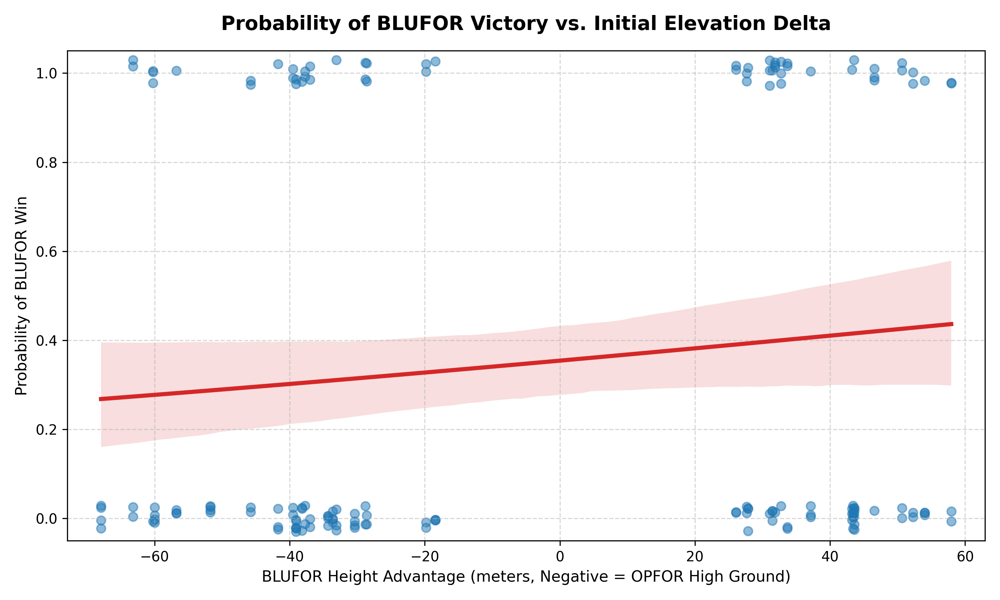
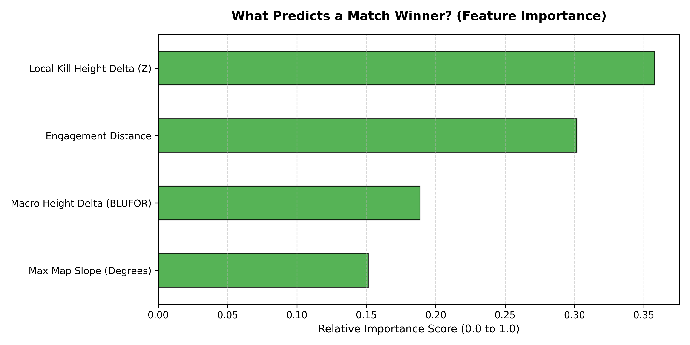
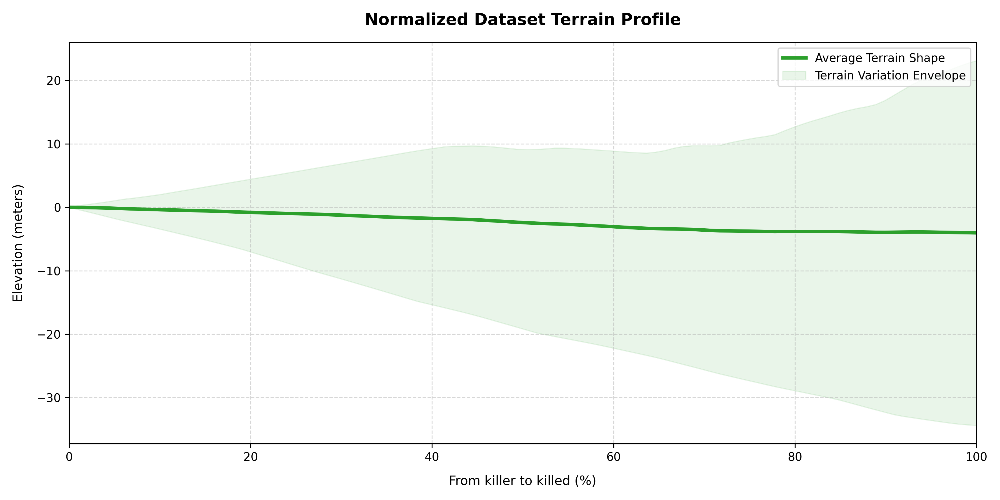

# Arma 3 Combat Analytics: The Impact of Terrain on Infantry Engagements

An automated data pipeline and analytics suite designed to parse, aggregate, and visualize infantry combat engagements within Arma 3 sandbox environments. This project evaluates how macro-terrain layouts (spawn positioning) versus micro-tactical variables (firefight-level dynamics) influence match outcomes on the map of Altis.

## Data Collection
Data was acquired by modifying another project of mine, [Akela](https://github.com/KrauzerKrip/akela), to automatically conduct infantry combat between BLUFOR and OPFOR bots in Arma 3. In this simulation, BLUFOR is permanently assigned as the attacker, and OPFOR permanently acts as the defender. Each faction deployed 4 infantryman per match. In total, the dataset comprises 160 simulated battles resulting in 975 recorded kills. The algorithm intentionally selected highly varied terrain patterns and starting parameters to test structural hypotheses about how terrain influences combat outcomes

Skills of units were set in the following way:
    general: 0.7
    courage: 1.0
    aimingAccuracy: 0.45
    aimingShake: 0.6
    aimingSpeed: 0.65
    commanding: 0.8
    endurance: 0.7
    spotDistance: 0.85
    spotTime: 0.75
    reloadSpeed: 0.7

## Methodology
- Terrain Profile Extraction: Parsers extract bounded sub-grid matrices from ASCII Digital Elevation Models (.asc DEMs). DEM extracted using [grad_meh](https://github.com/gruppe-adler/grad_meh),
- Data Ingestion & Alignment: Parses structured JSON match manifests and JSONL (.jsonl) live event streams, converting raw global vectors into signed, faction-specific metrics (e.g., aligning data from BLUFOR's perspective as the permanent attacker).

## Empirical Findings Summary

Across the 160 simulated matches, there is a pronounced disparity in win rates, indicating a significant structural advantage for the defending force.

|Force|Role|Wins|Win|Percentage|
|-----|----|----|---|----------|
|**BLUFOR**|Attacker|56|35.0%|
|**OPFOR**|Defender|104|65.0%|

### Macro Elevation vs. Defender Advantage
The logistic regression below maps the probability of an attacking victory against the initial starting elevation difference between the two teams. 



Even when BLUFOR is given a substantial initial macro-elevation advantage (up to 60 meters), their baseline probability of winning only scales from roughly **25% to 45%**. The data suggests that while macro-level high ground distinctly improves the attacker's odds, it is not enough on its own to reliably overcome the inherent tactical advantage of being the defending force in this sandbox.

### Micro vs. Macro Positioning
While starting on a hill helps, where you stand when the bullets fly matters more. 



According to our Random Forest classification model, **Local Kill Height Delta (Z)** is the leading terrain-based predictor of a match winner (scoring ~0.36 relative importance). This outweighs the **Macro Height Delta** (~0.19) by nearly double. This confirms that securing micro-terrain advantages during an active firefight is significantly more critical to survival than the group's initial spawn elevation.

### The anatomy of a mid-to-long range kill
To understand the structural shape of the terrain during a successful engagement, the pipeline extracts a physical cross-section of the map from the killer to the victim. Because engagements happen at vastly different ranges, the absolute distance in meters is mathematically normalized onto a uniform 0% to 100% relative scale. This allows the pipeline to aggregate and average the underlying slope of hundreds of different firefights.

Initially, this data was heavily skewed by point-blank and close-quarters combat (CQC), where terrain slope is practically flat and irrelevant. To isolate the true impact of macro-terrain, a 100-meter minimum distance filter was applied to the dataset.



By filtering out the CQC noise, a distinct physical reality emerges: the average mid-to-long-range kill is fired downhill. The aggregated terrain profile shows a consistent, pronounced downward slope from the killer's position (0%) to the victim's position (100%). This visually confirms that in Arma 3 bot combat, a slight uphill position won't hurt.

## Getting Started
System Prerequisites

This repository contains a declarative Nix Flake configuration for guaranteed cross-system reproducability.

### Option A: Using Nix (Recommended)
If you have Nix installed with Flakes enabled:
```bash
nix-shell -p uv
uv sync
nix develop
uv run main.py
```

### Option B: Standard Python (UV)
```bash
# Using uv, a convenient and fast python package/project manager
uv sync
uv run main.py
```
